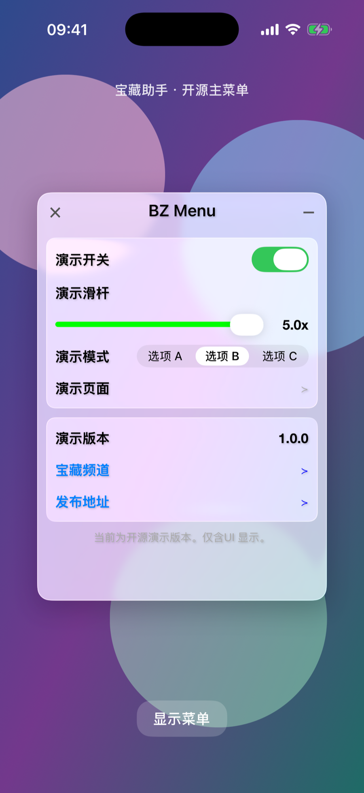
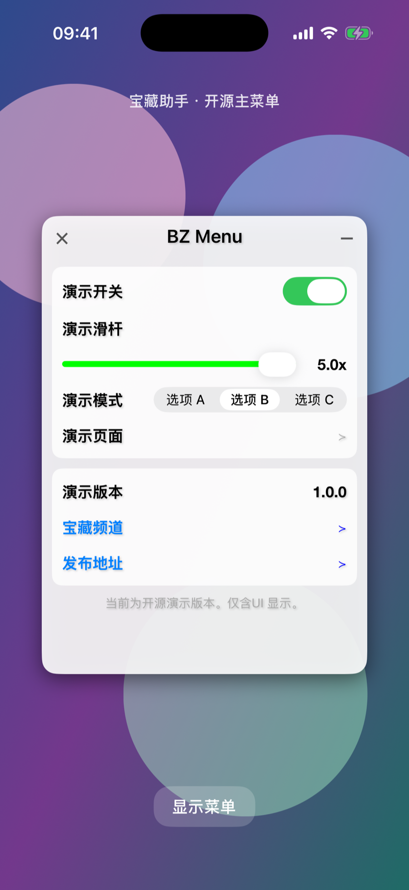

# bzhelper

宝藏助手开源版，先放出双套主题主菜单 UI（`BZMenuKit`）。

视觉对齐现网主菜单壳：320×450、常规 / 液态玻璃、标题栏、拖拽、功能区 + 信息区。iOS 26+ 的液态玻璃走系统 `UIGlassEffect`，更低版本回落到毛玻璃渐变。Demo 只放演示控件。

This repository publishes the overlay menu UI. The chrome matches the shipping panel; the demo only shows sample rows.

## 预览

| 液态玻璃 | 常规主题 |
| --- | --- |
|  |  |

用 Xcode 打开 [`BZMenuKit.xcodeproj`](BZMenuKit.xcodeproj)，跑 `BZMenuKitDemo`。

- 启动后自动弹出菜单
- 长按「演示版本」在常规主题和液态玻璃之间切换
- 右上角 `−` 收起，左上角 `×` 弹出确认（Demo 不会杀进程）
- 双指双击收起

## 嵌入

最低 iOS 13。把 `Sources/BZMenuKit` 拖进工程，或用 Swift Package 指向本仓库。

```objc
#import "BZMenuKit.h"

BZMenuConfiguration *config = [BZMenuConfiguration new];
config.title = @"BZ Menu";
config.theme = BZMenuThemeStyleGlass;
config.themePersistenceKey = @"bz_menu_theme";
config.sections = @[
    [BZMenuSection functionSectionWithItems:@[
        [BZMenuItem switchItem:@"demo.switch" title:@"演示开关" on:YES],
        [BZMenuItem sliderItem:@"demo.slider" title:@"演示滑杆" value:2 min:1 max:5],
        [BZMenuItem segmentItem:@"demo.mode" title:@"演示模式"
                        options:@[@"选项 A", @"选项 B", @"选项 C"] selected:0],
        [BZMenuItem disclosureItem:@"demo.page" title:@"演示页面"],
    ]],
    [BZMenuSection infoSectionWithItems:@[
        [BZMenuItem valueItem:@"version" title:@"演示版本" value:@"1.0.0"],
    ]],
];
[BZMenuPanel presentInView:self.view configuration:config delegate:self];
```

主题由 `BZMenuTheming` 绘制，行由 `BZMenuItem` 声明。宿主只提供数据和回调。

## 目录

```
Sources/BZMenuKit/   可复用 UI 组件
Demo/                演示用主菜单
```

## 许可证

[MIT](LICENSE)
